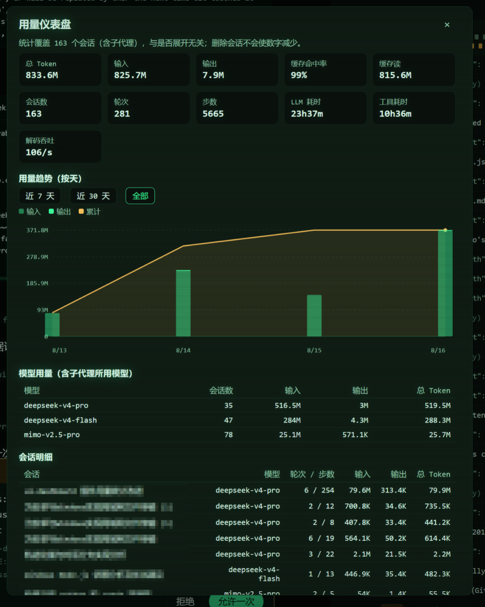

# dsh-usage-dashboard

English | [中文](README.zh.md)

A usage dashboard for DeepSeek Harness web deployments, shipped as a **dynamic
Cordis plugin** (one host half, one browser half). It replaces the sidebar's
built-in usage dialog with a durable, deployment-wide usage ledger that fixes
the built-in dashboard's four structural problems:

1. **No manual expansion.** The built-in dashboard folds only the sessions the
   browser has loaded. This plugin backfills every persisted session straight
   from the session logs at activation, then folds every committed event live —
   nothing needs to be opened first.
2. **Deleting a conversation never reduces the totals.** The ledger lives in its
   own storage domain (`usage_dashboard` in the harness storage root),
   completely separate from the session logs and their projection caches.
3. **Backup and migration.** The dialog exports the whole ledger as one JSON
   document and imports it again — importing into a fresh deployment restores
   the full history, and re-importing the same backup never double counts.
4. **Exact numbers — no more, no less.** The fold mirrors the harness's own
   `tokenUsage` / `sessionStats` projection semantics field-for-field (verified
   against the harness folds over randomized event sequences): same-step usage
   samples replace instead of adding, fork/subagent seed prefixes are skipped so
   an ancestor's history is counted exactly once, and every write is
   cross-checked against the live `tokenUsage` projection with a loud mismatch
   log.

It also records the **models used by subagents** (each subagent is its own
session, attributed to its parent), and draws the usage trend **per day** —
stacked input/output bars plus a cumulative line, with 7-day / 30-day / all
windows.

## Requirements

A DeepSeek Harness **web-profile** deployment that mounts `storage-domain` and
`session-persistence` (the standard web bundle does). The plugin reads only
public services — it changes no harness code.

## Loading the plugin

The plugin is a dynamic Cordis package. In the harness GUI (or via the cordis
API): define a package whose **host half is `src/host.js`** and whose **client
half is `src/client.js`**, then run it and approve the browser half. The sidebar
"用量" action now opens the ledger-backed dashboard (it replaces the built-in
entry in `sidebar.footer.action`; stopping the plugin restores the built-in
one).

## What the dialog shows

- **Stat cards** — total / input / output tokens, cache-hit share, cache
  read/write, session count, turns, steps, LLM and tool wall time, decode
  throughput.
- **Usage trend (per day)** — stacked input/output bars with a cumulative
  line, legend, dashed gridlines, sparse date ticks, and window selection.
- **Model usage** — per-model totals including the models subagents billed,
  with distinct-session counts.
- **Session table** — per-session tokens, newest billed model, turns/steps,
  with a 子代理 badge for subagent sessions.
- **Backup & migration** — export (copy the JSON document to a file) and
  import (paste a backup and merge it).

## Data semantics

- Each ledger record is keyed by `sessionId@createdAt` and carries the folded
  state (per-day and per-model token buckets, turns/steps/timings, newest
  billed model) plus a seq watermark. Records only ever advance: writes are
  serialized per key and a lower-watermark snapshot can never regress a stored
  record.
- A session's own suffix starts at its header's `seedLength`: fork and
  subagent children count exactly what they themselves billed, and the
  inherited prefix stays attributed to the ancestor — the totals are the true
  billed usage with no double counting anywhere in a fork tree.
- Live sessions fold through `session/event` with `{ global: true }` listeners
  (a dynamic package mounts in the requesting session's agent scope; without
  the flag other conversations' events would never reach it). Activation heals
  every stored tail, materializes live cells, and `usage.report` additionally
  backfills any session the ledger has never seen, so the report is complete
  even for sessions created while the plugin was stopped.
- The backup document is `{ format: 'dsh-usage-dashboard-backup', version: 1,
  exportedAt, records }`. Import validates every record and merges by key: a
  record is adopted only when its seq is higher than the stored one, so
  repeated imports are idempotent.

## Known limitations

- **Process-local.** Dynamic plugins do not survive a harness restart: re-run
  the package after restarting. The ledger itself is durable, so the numbers
  continue seamlessly on the next activation.
- **Backup travels as text.** Export renders the JSON document in a textarea
  (copy it to a file); import accepts the same JSON pasted back.
- **Day buckets use the host's local calendar.** Totals never depend on the
  bucket; only the trend chart's grouping does.
- **Sessions whose logs were deleted before the plugin ever ran** cannot be
  reconstructed — there is nothing left to fold. Everything present in the
  store is counted.
- Per-session titles are joined from the live session list when available;
  sessions no longer in the list (e.g. deleted) show a short id.

## Repository layout

- `src/host.js` — the exact `code.host` function body (ledger, heal/backfill,
  report/export/import RPC).
- `src/client.js` — the exact `code.client` function body (sidebar action and
  dialog).
